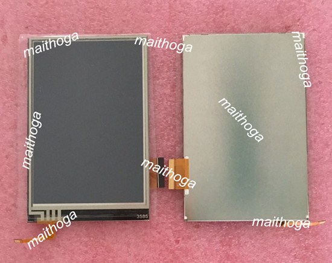
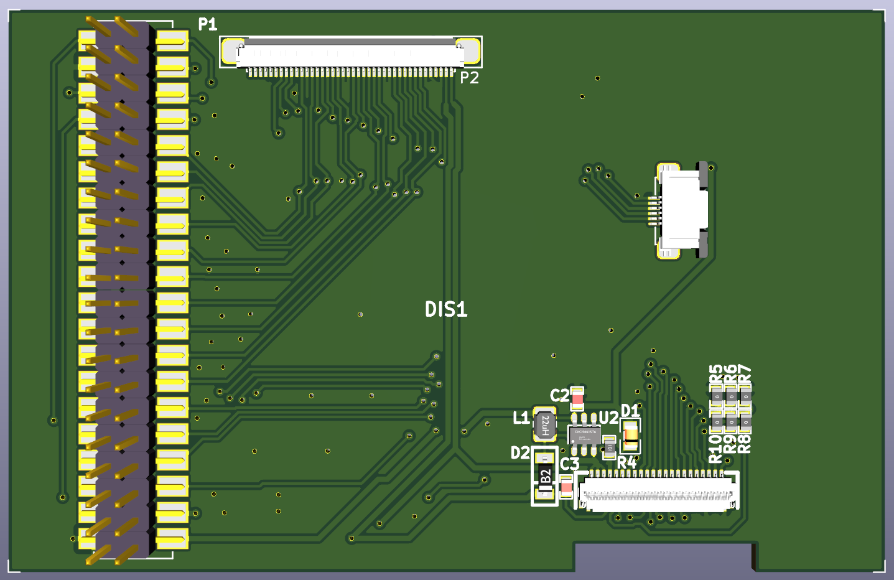

# maithoga_lcd_board_480x320_R61529
PCB Board for Maithoga display with resolution 480x320 based on chip R61529 compatible with ILI9481.

Access to display signal is possible with goldpin described below and fpc compatible with LicheePi Zero board.

Display view

